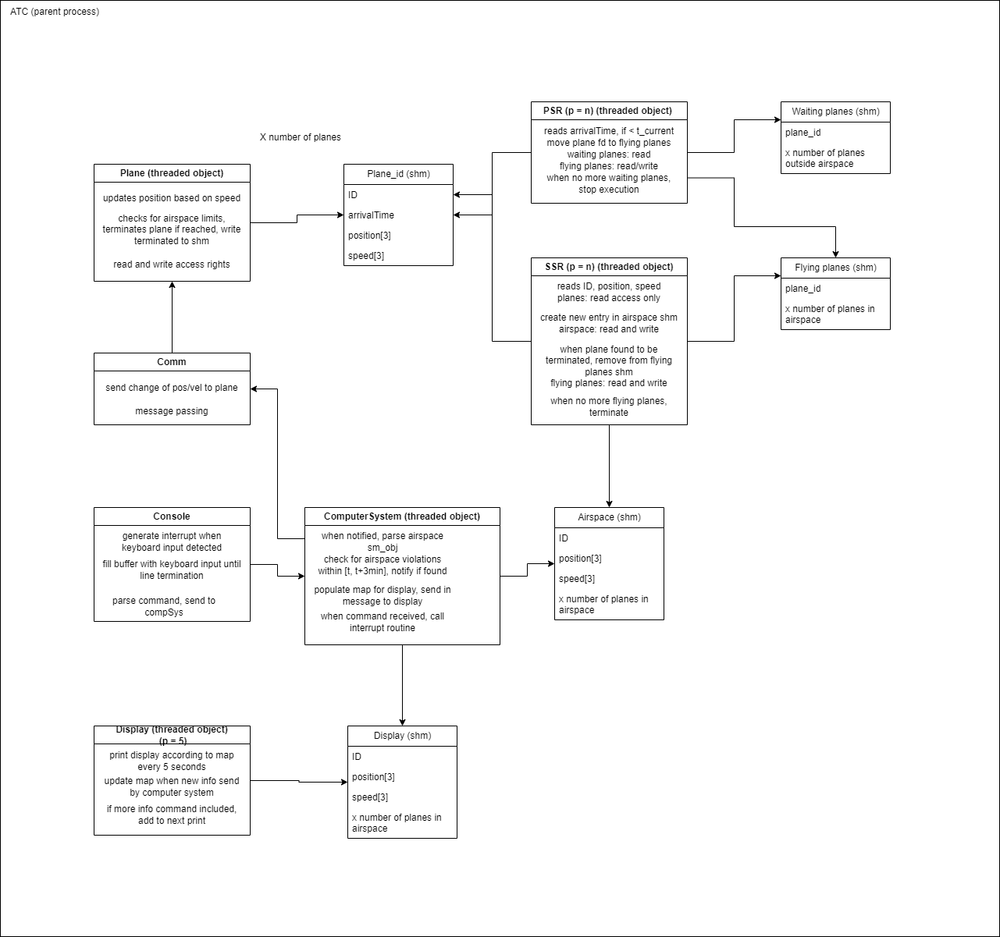

# ATC_COEN320

COEN 320 real-time systems project assignment

Air Traffic Control

## Setup

Please connect to your VM first as the following steps require a connection.

### Input Prep

1. Right click on the `input.txt` in the Project Explorer view in MomenticsIDE.
2. In MomenticsIDE, menu bar -> Window -> Show View -> Target File System Navigator
3. In the Target File System Navigator, right click on folder `tmp`, then select paste. You have now pasted the `input.txt` file into the VM for use.

### Building and Running

1. Clone the repo with ssh (for authentication and read/write access).
2. Open MomenticsIDE, go to File (top left) -> Existing Project into Workspace -> select root directory -> select the folder you just cloned -> Finish.
3. Wait.
4. Press the hammer button top left to compile.
5. ???
6. Profit ?

## Diagram

A basic diagram with information about classes and functions of the system:

